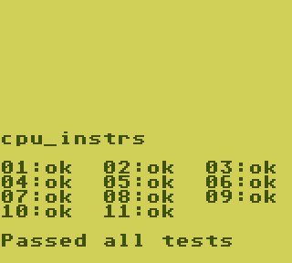
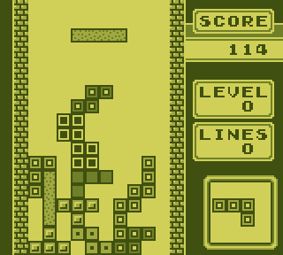
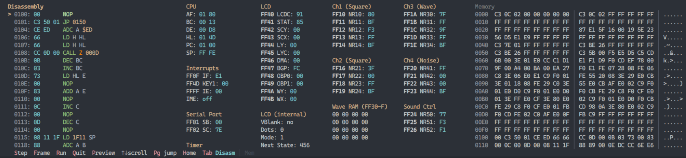

<div align="center">
  
  <h3>Monoboy</h3>
</div>

Monoboy is a Game Boy emulator. Hardware behavior is informed by [Pan Docs](https://gbdev.io/pandocs/).


## Screenshots

|                                                       |                              |
| ----------------------------------------------------- | ---------------------------- |
|  |                              |
|       |  |


## Desktop application

The **Monoboy.Desktop** project is the main executable. With no extra arguments it opens the Raylib window (see controls below). It also supports two console modes:

| Mode                 | Flag        | Description                                                                                                                      |
| -------------------- | ----------- | -------------------------------------------------------------------------------------------------------------------------------- |
| Graphical            | _(default)_ | Full emulator UI with keyboard/gamepad input.                                                                                    |
| Console debugger     | `--debug`   | Terminal UI: disassembly, register grid, memory dump, and optional framebuffer preview.                                          |
| Headless test runner | `--test`    | Runs the core for a fixed number of steps or frames, then prints **one JSON object** on stdout (for automated tests or tooling). |

### Common arguments

- **ROM path** — Optional. Give the path to a `.gb` / `.gbc` file as the first argument that does **not** start with `--`. If it is missing or the file does not exist, the core boots with an empty 64 KiB buffer (same idea as the debugger when no ROM is loaded).
- **`--log-header`** — *(TUI only.)* Print cartridge header information when opening a ROM.

Examples:

```bash
monoboy path/to/game.gb
monoboy --debug path/to/game.gb
monoboy --test path/to/test.gb --steps 5000
```

### `--debug` (TUI debugger)

Spectre.Console-based layout: disassembly on the left, register / I/O panels in the center, full-height memory dump on the right. The view tracks terminal size; resize the window to reflow.

| Key                     | Action                                                        |
| ----------------------- | ------------------------------------------------------------- |
| **S**                   | Step one CPU instruction.                                     |
| **F**                   | Step one frame (until the next VBlank boundary).              |
| **R**                   | Run 500 instructions.                                         |
| **Q**                   | Quit.                                                         |
| **Tab**                 | Switch focus between disassembly and memory panes.            |
| **Arrow keys**          | Scroll the focused pane (disassembly or memory).              |
| **Page Up / Page Down** | Scroll by about one screen in the focused pane.               |
| **Home**                | Reset disassembly and memory scroll to the default positions. |
| **P**                   | Open a framebuffer preview popup.                             |



### `--test` (JSON snapshot)

Use this mode from scripts or test harnesses. Output is a single line of JSON on standard output (no extra logging). `schemaVersion` is `1`; bump it if the shape changes.

- **`--steps N`** — Run `N` calls to `Step()`. If present, **`--frames` is ignored.**
- **`--frames N`** — Run `N` full frames via `StepFrame()`. Default is **1** if `--steps` is not used.
- **`--memory START:LENGTH`** or **`--memory START,LENGTH`** — Optional. Include a **`memory`** object: bus reads from `START` for `LENGTH` bytes. `START` and `LENGTH` accept decimal or `0x` hex. If the range would pass `0x10000`, the length is clamped.

The **`cpu`** object includes 8-bit registers, 16-bit pairs (`af`, `bc`, `de`, `hl`), `pc`, `sp`, `ie`, interrupt flags as JSON property **`if`** (not a keyword in JSON), `ime`, `halted`, and `totalCycles`. The **`memory`** field is omitted unless `--memory` is valid.

Example:

```bash
monoboy --test rom.gb --frames 10 | jq '.cpu.pc'
monoboy --test rom.gb --memory 0xC000:256
```

## Gameboy Controls

| Gameboy | Keyboard  | Gamepad | Alternative       |
| ------- | --------- | ------- | ----------------- |
| Right   | D         | Stick   | Dpad / Arrow Keys |
| Left    | A         | Stick   | Dpad / Arrow Keys |
| Up      | W         | Stick   | Dpad / Arrow Keys |
| Down    | S         | Stick   | Dpad / Arrow Keys |
| A       | Space     | A       |                   |
| B       | ShiftLeft | B       |                   |
| Start   | Escape    | Start   |                   |
| Select  | Enter     | Select  |                   |

## Emulator Controls

| Action                | Shortcut | Alternative           |
| --------------------- | -------- | --------------------- |
| Speedup 5 time        | F        |                       |
| Pause                 | P        |                       |
| Open Rom              | Ctrl+O   | Drop file into window |
| Screenshot            | F2       |                       |
| Dump Memory           | F5       |                       |
| Dump Background Image | F6       |                       |
| Dump Tilemap Image    | F7       |                       |

## Palette

`Pallet.txt` contains the four RGB hex colors used for rendering and defaults to:

```
D0D058
A0A840
708028
405010
```
