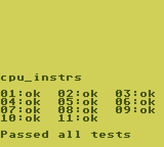
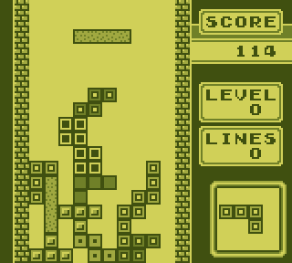

<div align="center">
  
  <h3>Monoboy</h3>
</div>

Monoboy is a Game Boy emulator. Hardware behavior is informed by [Pan Docs](https://gbdev.io/pandocs/).


## Screenshots


> blargg's cpu_instrs passing


> Super Marioland


> Tetris


## Desktop application

The **Monoboy.Desktop** project is the main executable. With no extra arguments it opens the Raylib window (see controls below). It also supports two console modes:

| Mode                 | Flag        | Description                                                                                                                      |
| -------------------- | ----------- | -------------------------------------------------------------------------------------------------------------------------------- |
| Graphical            | _(default)_ | Full emulator UI with keyboard/gamepad input. Press **F12** to show or hide the GUI debugger.                                    |
| TUI debugger         | `--debug`   | Terminal debugger: disassembly, registers, memory dump, breakpoints.                                                             |
| Headless test runner | `--test`    | Runs the core for a fixed number of steps or frames, then prints **one JSON object** on stdout (for automated tests or tooling). |

### Common arguments

- **`-h` / `--help`** — Print usage and exit.
- **ROM path** — Optional. Give the path to a `.gb` / `.gbc` file as the first argument that does **not** start with `--`. If it is missing or the file does not exist, the core boots with an empty 64 KiB buffer (same idea as the debugger when no ROM is loaded).
- **`--log-header`** — Print cartridge header information when opening a ROM (debugger and graphical modes).
- **`--custom-boot`** — Use the embedded bootix boot ROM instead of the built-in boot (graphical mode only).

Examples:

```bash
monoboy path/to/game.gb
monoboy --debug path/to/game.gb
monoboy --test path/to/test.gb --steps 5000
```

### GUI debugger (F12)

In the graphical window, press **F12** to show or hide the debugger. It uses dockable ImGui windows (LCD, PPU views, disassembly, registers, memory). Drag a splitter to resize panes. Drag a window title bar out to float it. Drop a window on another to tab it. Use the **View** menu to reopen a window you closed with **X**. Layout is saved in `monoboy-layout.ini` next to the executable. No extra CLI flag is required.

| Input | Action |
| ----- | ------ |
| **F12** | Show or hide the debugger. |
| **F3** | Step one CPU instruction. |
| **F8** | Step over (next). |
| **F9** | Continue execution. |
| **Shift+F9** | Stop (pause). |
| **Ctrl+R** | Reset the emulator. |
| **F10** | Step one frame (next VBlank). |
| **Shift+O** | Toggle OAM viewer window. |
| **Shift+B** | Toggle BG and WIN viewer windows. |
| **Shift+T** | Toggle VRAM (tiles) viewer window. |

### `--debug` (TUI debugger)

Terminal debugger. Common keys: **S** step, **R** run to breakpoint, **B** toggle breakpoint, **Tab** switch pane, arrows / Page Up / Page Down scroll, **Ctrl+R** reload ROM.

### `--test` (JSON snapshot)

Use this mode from scripts or test harnesses. Output is a single line of JSON on standard output (no extra logging). `schemaVersion` is `1`; bump it if the shape changes.

- **`--steps N`** — Run `N` calls to `Step()`. If present, **`--frames` is ignored.**
- **`--frames N`** — Run `N` full frames via `StepFrame()`. Default is **1** if `--steps` is not used.
- **`--memory START:LENGTH`** or **`--memory START,LENGTH`** — Optional. Include a **`memory`** object: bus reads from `START` for `LENGTH` bytes. `START` and `LENGTH` accept decimal or `0x` hex. If the range would pass `0x10000`, the length is clamped.

The **`cpu`** object includes 8-bit registers, 16-bit pairs (`af`, `bc`, `de`, `hl`), `pc`, `sp`, `ie`, interrupt flags as JSON property **`if`** (not a keyword in JSON), `ime`, `halted`, and `totalCycles`. The **`memory`** field is omitted unless `--memory` is valid.

Example:

```bash
monoboy --test rom.gb --frames 10 | jq '.cpu.pc'
monoboy --test rom.gb --memory 0xC000:256
```

## Gameboy Controls

| Gameboy | Keyboard  | Gamepad | Alternative       |
| ------- | --------- | ------- | ----------------- |
| Right   | D         | Stick   | Dpad / Arrow Keys |
| Left    | A         | Stick   | Dpad / Arrow Keys |
| Up      | W         | Stick   | Dpad / Arrow Keys |
| Down    | S         | Stick   | Dpad / Arrow Keys |
| A       | Space     | A       |                   |
| B       | ShiftLeft | B       |                   |
| Start   | Escape    | Start   |                   |
| Select  | Enter     | Select  |                   |

## Emulator Controls

| Action                | Shortcut | Alternative           |
| --------------------- | -------- | --------------------- |
| Speedup 5 time        | F        |                       |
| Pause                 | P        |                       |
| Open Rom              | Ctrl+O   | Drop file into window |
| Screenshot            | F2       |                       |
| Dump Memory           | F5       |                       |
| Dump Background Image | F6       |                       |
| Dump Tilemap Image    | F7       |                       |
| Toggle GUI debugger   | F12      |                       |

## Palette

Optional `Pallet.txt` in the working directory overrides the four RGB hex colors used for rendering. Default palette:

```
D0D058
A0A840
708028
405010
```
