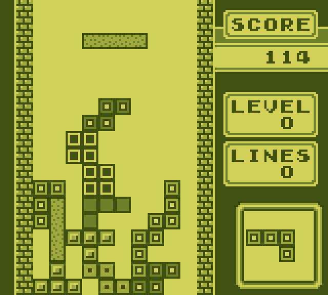

<p align="center">
    <h1>Monoboy</h1>
    
</p>

Reference: https://gbdev.io/pandocs/

## Gameboy Controls

| Gameboy | Keyboard  | Gamepad | Alternative       |
| ------- | --------- | ------- | ----------------- |
| Right   | D         | Stick   | Dpad / Arrow Keys |
| Left    | A         | Stick   | Dpad / Arrow Keys |
| Up      | W         | Stick   | Dpad / Arrow Keys |
| Down    | S         | Stick   | Dpad / Arrow Keys |
| A       | Space     | A       |                   |
| B       | ShiftLeft | B       |                   |
| Start   | Escape    | Start   |                   |
| Select  | Enter     | Select  |                   |

## Emulator Controls

| Action                | Shortcut | Alternative           |
| --------------------- | -------- | --------------------- |
| Speedup 5 time        | F        |                       |
| Pause                 | P        |                       |
| Open Rom              | Ctrl+O   | Drop file into window |
| Screenshot            | F2       |                       |
| Dump Memory           | F5       |                       |
| Dump Background Image | F6       |                       |
| Dump Tilemap Image    | F7       |                       |

## Pallet

`Pallet.txt` contains the pallet to render the game in and default to
```
D0D058
A0A840
708028
405010
```

## Screenshots


|  |                              | 
| ----------------------------------------------------  | ---------------------------- |
|       |  |


### Linux notes
veldrid cant find libdl.so
Fix is to make a sym link
```
sudo ln -s /usr/lib/libdl.so.2 /usr/lib/libdl.so
```
